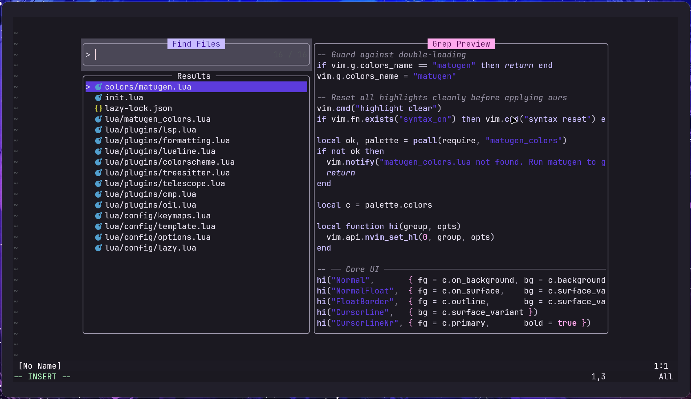
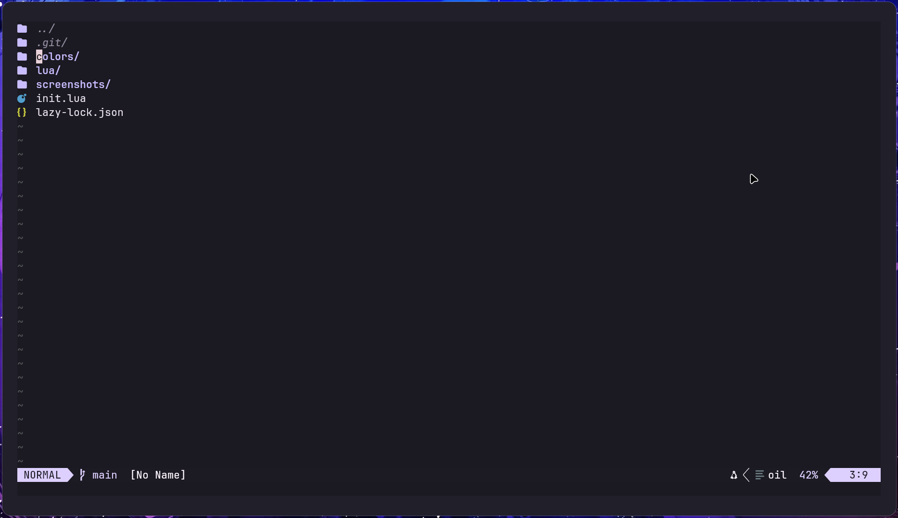
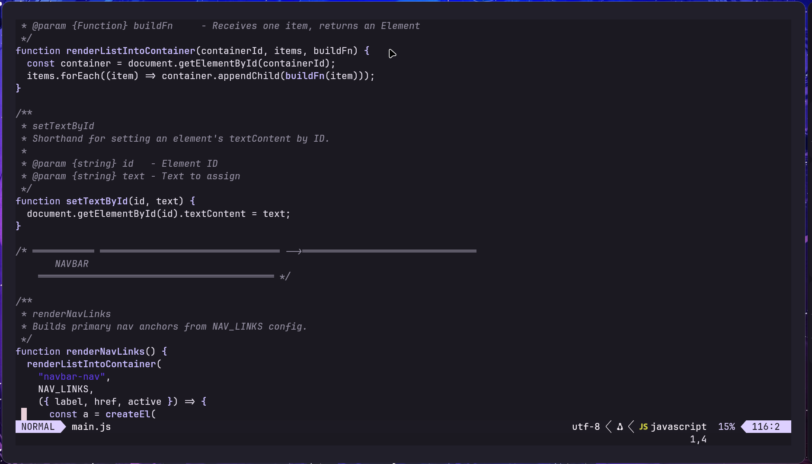

# Neovim Material You 3 Config with Matugen

This is a personal Neovim config that has dynamic color generation with Matugen based on your wallpaper.
It includes the folllowing basic utilities:
- Telescope
- Tree-sitter
- LSP
- Oil (file navigation, no neo-tree btw)
- Conform ( for formatting )

Please note that this config is highly opinionated and might be suit for everyone.

Here are some screenshots:

